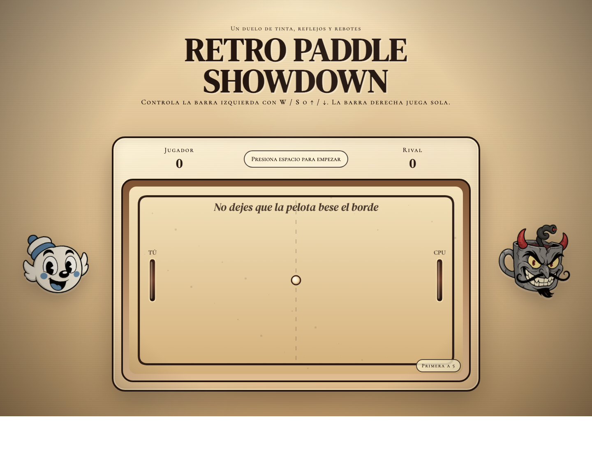

# Retro Paddle Showdown

Juego de ping pong arcade hecho con `HTML`, `CSS` y `JavaScript`, con una dirección visual inspirada en caricatura retro de los años 30: tonos sepia, textura cinematográfica, marco ornamental y personajes laterales con mucha personalidad.



## Que incluye

- Una barra controlada por el jugador del lado izquierdo.
- Un rival con IA del lado derecho.
- Pelota con aceleracion progresiva en cada rebote para partidas mas intensas.
- Estetica retro con vibra de animacion clasica y acabado de cartel vintage.
- Interfaz lista para abrirse directamente en el navegador sin dependencias.

## Controles

- `W`: mover la barra hacia arriba
- `S`: mover la barra hacia abajo
- `Flecha arriba`: mover la barra hacia arriba
- `Flecha abajo`: mover la barra hacia abajo
- `Espacio`: iniciar el juego o sacar de nuevo tras un punto

## Como se juega

Tu controlas la barra izquierda. La CPU controla la barra derecha.

El objetivo es evitar que la pelota llegue al borde de tu lado y devolverla tantas veces como puedas. Cada contacto con una barra aumenta bastante la velocidad de la pelota, asi que los intercambios se vuelven mas rapidos conforme avanza la partida.

La partida se juega a `5 puntos`.

## Ejecutarlo localmente

No necesitas instalar nada. Solo abre el archivo [`index.html`](./index.html) en tu navegador.

Si prefieres usar un servidor local:

```bash
python3 -m http.server 8000
```

Luego abre:

```text
http://localhost:8000
```

## Estructura del proyecto

```text
.
├── assets/
│   ├── cpu.png
│   ├── game-preview.png
│   └── player.png
├── index.html
├── script.js
└── styles.css
```

## Detalles visuales

- Fondo con sensacion de papel envejecido
- Efecto de flicker estilo pelicula antigua
- HUD decorativo con acabado de gabinete arcade retro
- Personaje bueno del lado izquierdo y personaje villano del lado derecho

## Autor

Proyecto creado y publicado desde Codex 
